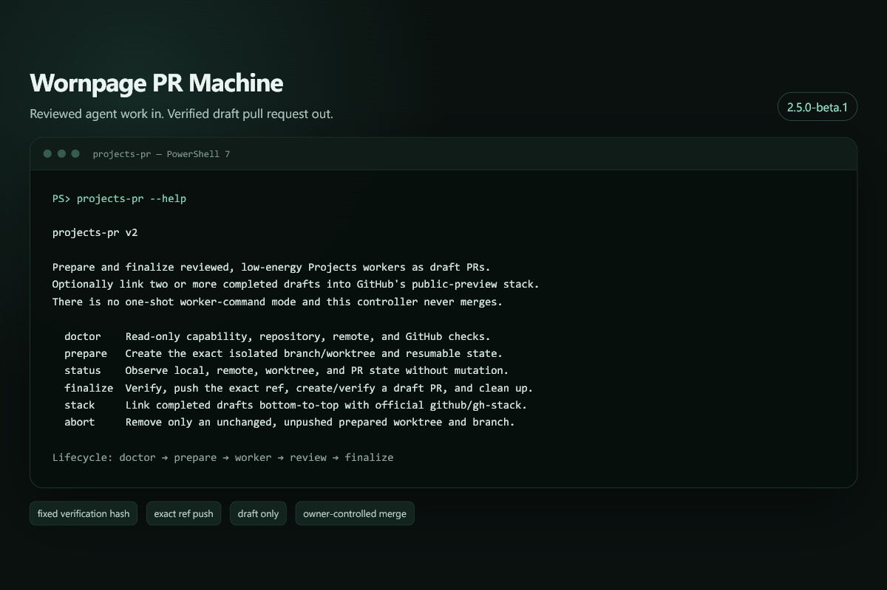

# Wornpage PR Machine

Turn reviewed agent work into a verified **draft** pull request while keeping merge authority with the repository owner.

This public beta packages the controller used in the Wornpage Projects development workflow. It prepares an isolated Git worktree, fixes the verification command before work begins, verifies the resulting commit, pushes only the derived branch, creates or resumes one matching draft PR, and emits bounded JSON receipts throughout.



> **Beta boundary:** run one controller process per repository. Child-process timeouts and cross-process lifecycle locking are planned before a general-availability release.

## Why it is different

| Boundary | Enforced behavior |
| --- | --- |
| Worker capacity | One worker per draft PR |
| Verification | Fixed and SHA-256-bound at `prepare` |
| Git mutation | One derived branch and one sibling worktree |
| Push | Exact `HEAD:refs/heads/<derived-branch>` refspec |
| Pull request | Open draft only, verified against the GitHub API |
| Recovery | Resumable state with bounded next commands |
| Merge | Never requested; always owner-controlled |

The controller does **not** choose work, run an agent, accept evidence, merge, enable auto-merge, close a PR, deploy, or act as a sandbox.

## Challenge-extension evidence

The public [Wornpage Projects WebMCP Challenge repository](https://github.com/wornpage/projects-webmcp-extension) records 32 merged PRs created on `projects-pr/task-*` branches from Projects pack handoffs between August 27 and September 1, 2026. Their PR bodies explicitly require owner review and state that the controller does not merge or enable auto-merge.

Representative receipts are visible in [PR #1](https://github.com/wornpage/projects-webmcp-extension/pull/1), [PR #38](https://github.com/wornpage/projects-webmcp-extension/pull/38), and [PR #70](https://github.com/wornpage/projects-webmcp-extension/pull/70). This evidence establishes use and owner-gated delivery; it does not claim autonomous authorship, independent GitHub review, universal green CI, time saved, or quality causation. See [the case study](docs/challenge-extension-case-study.md).

## Requirements

- Node.js 22 or newer
- Git
- GitHub CLI (`gh`), authenticated for the target GitHub host
- PowerShell 7 on Windows or `/bin/sh` on Unix
- A clean checkout on the declared base branch whose commit matches the remote base

Stacked drafts are optional and additionally require the official `github/gh-stack` extension. The controller checks that exact extension before any stack mutation and never installs it automatically.

## Install

Install the beta tarball from its GitHub release:

```sh
npm install --global https://github.com/wornpage/projects-pr-machine/releases/download/v2.5.0-beta.1/wornpage-projects-pr-2.5.0-beta.1.tgz
projects-pr --help
```

The package is prepared for the public npm name `@wornpage/projects-pr`; registry publication will follow once trusted publishing is configured.

## Controller lifecycle

Start with the read-only capability check:

```sh
projects-pr doctor --repo . --base main --remote origin
```

Then use the explicit lifecycle:

```text
doctor → prepare → worker → evidence review → finalize
```

`prepare` records the exact branch, worktree, base commit, repository identity, and verification-command hash. `finalize` refuses dirty or divergent state, runs the fixed command, verifies the tested commit at the exact remote ref, creates or resumes one matching draft PR, and removes only the exact clean worktree. Use `status` for read-only recovery and `abort` only for an unchanged, unpushed preparation.

The complete command and receipt contract is in [docs/projects-pr.md](docs/projects-pr.md).

## Codex integration

The repository includes the `projects-pack-delegation` Codex plugin source under [`integrations/codex/projects-pack-delegation`](integrations/codex/projects-pack-delegation). The plugin coordinates Projects packs, native Codex worker tasks, Worker Handoff v1 review, and this controller.

Full pack coordination depends on the separately operated Wornpage Projects MCP service and a tenant-scoped token. The public repository does not contain or prove the hosted service. Read [the trust guide](docs/agent-trust.md) before connecting it.

## Develop and verify

```sh
npm install --ignore-scripts
npm run check
```

The suite exercises the controller with injected Git, filesystem, shell, and GitHub effects; it creates no real remote branch or pull request. CI also installs the packed tarball in a clean consumer and verifies its public import and CLI help.

## License and provenance

Copyright © 2026 Wornpage.

Source is available under [GNU AGPL-3.0-only](LICENSE). The separately published challenge extension is MIT-licensed and contains no PR-machine source. See [SOURCE_PROVENANCE.md](SOURCE_PROVENANCE.md) for the extraction boundary.
